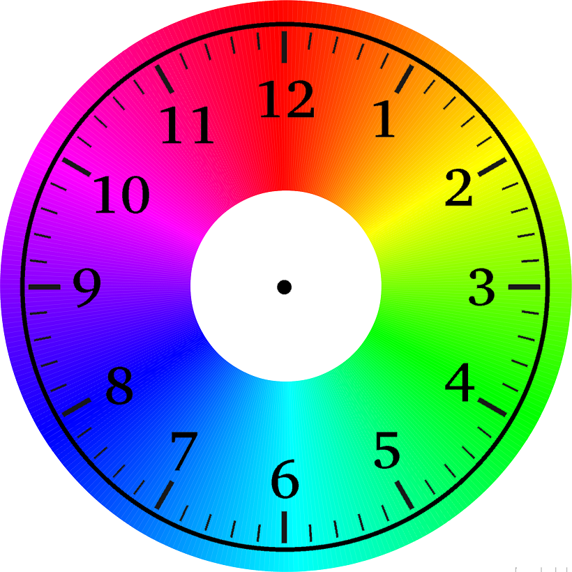
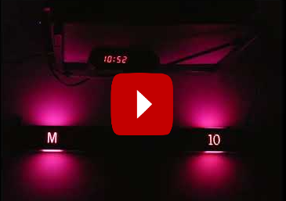
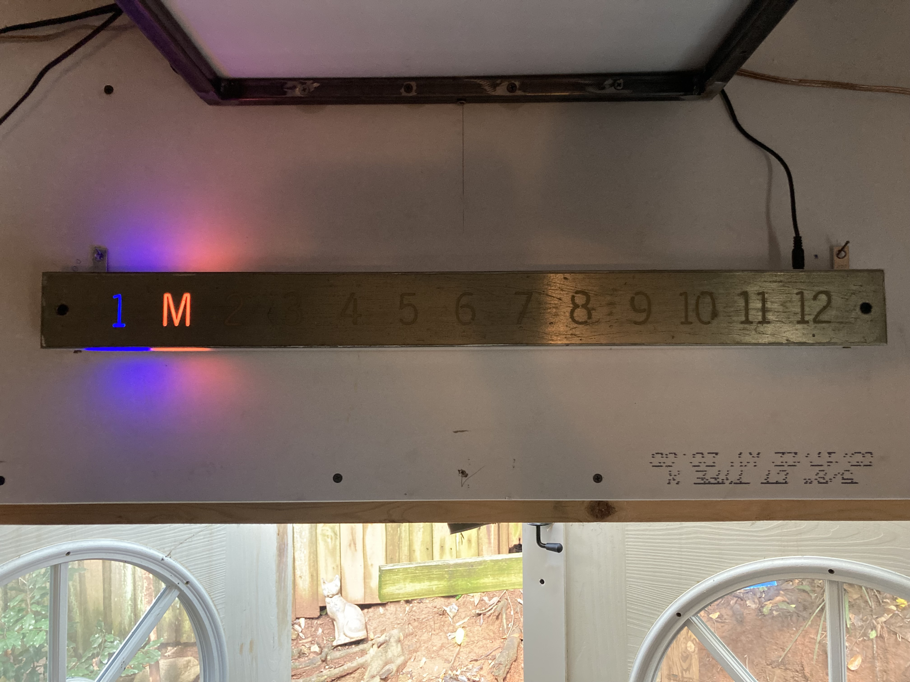
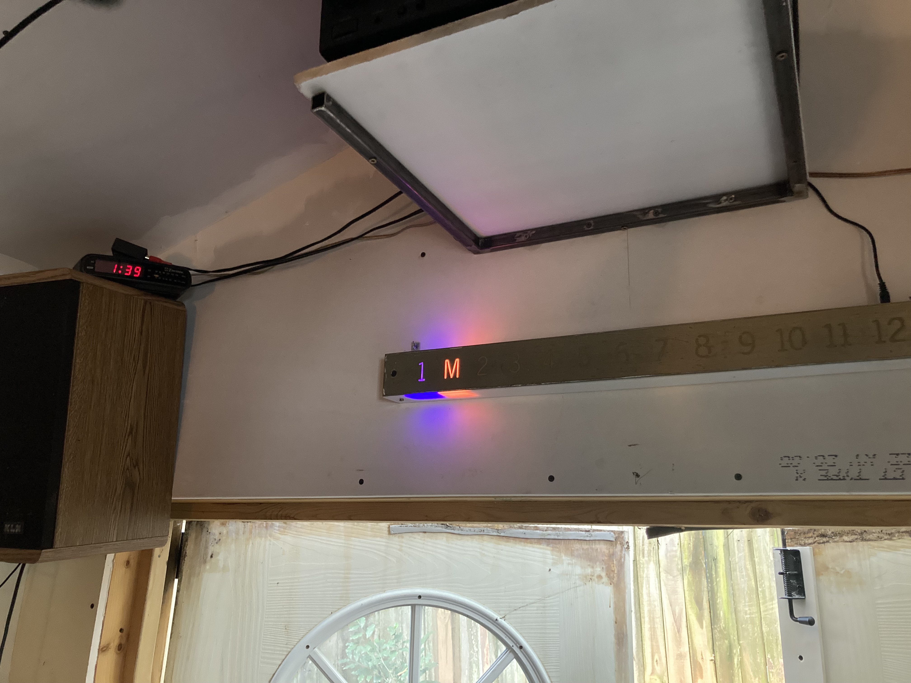

# Color Clock 
Create a clock using color to convey time!

I made this clock with a salvaged elevator indicator from an abandoned building. It was a 12 story building with a mezzanine level (hence the M). 

Using WS2812 addressable leds, the number of the hour lights up. The color of the hour inicates 'where we are' in the hour. 

Also, to indicate PM, I have lit up the Mezzanine M. It changes slowly throughout the afternoon, also cycling through the color wheel. 
Here is a ~12 hr time lapse of the clock working! 

For example, ~1:40Pm will have the 1 lit up blueish, and the M lit up red/orange:

You can see the digital clock confiming this:

3:00 - 3 lit up red

4:20 - 4 lit up greenish 

## Description

Using ESP32 to connect to NTP server to grab time, then lighting LED's based on that! 

## Help

contact me! 

## Version History

 originally made in Summer 2020 for Arduino Nano

 updated October 2022 to run with ESP32

## Acknowledgments

Patrick Morales with the color / time idea many years ago at House Electric in Athens, GA.

## TODO:
 - make ESP an access point so you can enter wifi info that way instead of having to upload code again
  - if there is no wifi, set the time manually from your device via the access point. (can we grab the device's time and just use that?) 
  - Having to set the UTC_OFFSET and DST manually in code is a little annoying too. 
    - Could use wifiLocation: https://www.arduino.cc/reference/en/libraries/wifilocation/
    - or geolocation of ip address
 - do fun animation at the top of the hour.. Like a cuckoo clock. 